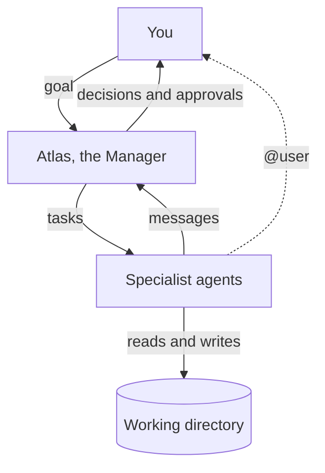

Five concepts explain almost everything in Syndicate.

## Workspace

A **workspace** is the unit you open and work in: either a team or a solo agent, plus the local **working directory** where its agents read and write files. Workspaces appear in the sidebar under **Team Hub** (teams) and **Solo Agents** (single agents).

All workspace data lives on your machine. See [Data and storage](/reference/data-and-storage).

## Team

A **team** is a Manager agent plus one or more specialist agents sharing a working directory, a task board, and a message bus. Teams are for work that benefits from multiple roles: build plus review, research plus writing, implement plus test.

See [Teams](/features/teams).

## Agent

An **agent** is a single AI worker with:

- a **name** and a **specialization** (its role and baked-in skills)
- a **model** (any model from a connected provider)
- a **Soul**: the markdown prompt that defines its expertise and behavior
- **skills** (slash-command workflows), **MCP tools**, and **permissions**

See [Agents](/features/agents).

## Atlas, the Manager

Every standard team has a Manager called **Atlas**. Atlas plans phases, creates and assigns tasks, coordinates the specialists, and escalates decisions to you. Atlas is a coordinator, not an implementer: it inspects the project read-only and delegates the actual work.

How much Atlas interrupts you is controlled by the team's **Interruption Level** (Minimal, Balanced, Hands-on, Manual).

See [Working with Atlas](/guides/create-your-first-team/atlas-orchestrator).

## Dispatch

**Dispatch** is how agents run. When you message an agent, when Atlas assigns work, or when a teammate sends a message, the recipient agent wakes up, does the work in the working directory, and reports back. Agent-to-agent traffic is visible in the **Agent Comms** feed; anything that needs you lands in **User Tasks** and your **Inbox**.

## Where things show up

| Surface | What it holds | Who acts |
|---|---|---|
| **Chat** | Your direct conversation with an agent or Atlas | You |
| **Agent Comms** | Agent-to-agent coordination feed | Nobody (read-only) |
| **User Tasks** | Questions, approvals, and decisions waiting on you | You |
| **Agent Tasks** | The work board: every task with owner and status | Atlas |
| **Task Health** | Board hygiene issues Atlas should clean up | Atlas (you can nudge) |
| **Inbox** | Messages addressed to you across all workspaces | You |

## Next steps

<CardGroup cols={2}>
  <Card title="Workspaces" icon="folder-open" href="/features/workspaces">
    Layout, working directories, and lifecycle.
  </Card>
  <Card title="Teams" icon="users" href="/features/teams">
    The Team Hub, dashboard, and team controls.
  </Card>
  <Card title="Agents" icon="robot" href="/features/agents">
    Anatomy and configuration of a single agent.
  </Card>
  <Card title="Chat and dispatch" icon="comments" href="/features/chat-and-dispatch">
    How conversations and agent runs actually work.
  </Card>
</CardGroup>
