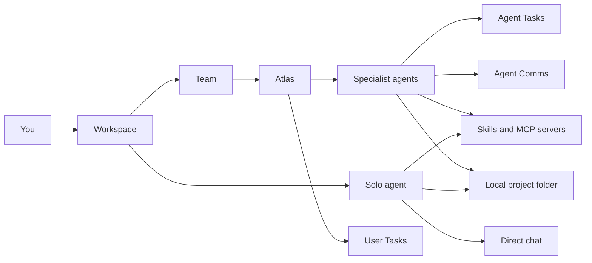

Syndicate turns a local project folder into a workspace where AI agents can plan, build, review, research, document, and coordinate with each other.

## What's in this section

The pages in this section describe the building blocks that shape every Syndicate setup.

### Concepts in this section

<CardGroup cols={2}>
  <Card title="Workspaces" icon="folder-tree" href="/features/workspaces">
    Where Syndicate organizes work around a local project folder.
  </Card>
  <Card title="Agents" icon="sparkles" href="/features/agents">
    The specialists you configure, including roles from the Agent Marketplace.
  </Card>
  <Card title="Teams" icon="users" href="/features/teams">
    A group of specialist agents coordinated by Atlas.
  </Card>
  <Card title="Solo agents" icon="user" href="/features/solo-agents">
    A single specialist agent for direct one-on-one work.
  </Card>
  <Card title="Providers and models" icon="plug" href="/features/providers-and-models">
    Claude, OpenAI/Codex, and Gemini accounts and the models agents run on.
  </Card>
</CardGroup>

### Where to go next

<CardGroup cols={2}>
  <Card title="Chat and dispatch" icon="list-checks" href="/features/chat-and-dispatch">
    Send work to an agent and watch what happens during a run.
  </Card>
  <Card title="Tasks" icon="list-checks" href="/features/tasks">
    Track User Tasks, Agent Tasks, and Task Health.
  </Card>
  <Card title="Agent Comms" icon="inbox" href="/features/inbox">
    Understand Agent Comms and user attention requests.
  </Card>
  <Card title="References" icon="book" href="/features/references-and-context">
    Give agents the project files and docs they need as context.
  </Card>
  <Card title="MCP servers" icon="blocks" href="/features/mcp">
    Connect agents to external tools and data sources.
  </Card>
</CardGroup>

## How a team coordinates work

Atlas is the Manager that coordinates a team. Instead of you assigning each step, you give Atlas an outcome and it decides who on the team should do what.

Dispatch is how Syndicate hands a message or task to an agent so it starts running. Atlas dispatches work to specialists, specialists report back through **Agent Comms**, and you stay in the loop through **User Tasks** when a decision needs you.

## Common ways to use Syndicate

| Goal | Use |
| --- | --- |
| Fix a bug | Solo engineer or team with Atlas, Coder, and QA |
| Build a feature | Team with Atlas plus specialists |
| Review code | Code review team or QA specialist |
| Write docs | Technical writer agent with project references |
| Research a topic | Researcher or research team |
| Coordinate many tasks | Team Workspace with Interruption Level, Agent Comms, Agent Tasks, and Task Health |

## Next steps

<CardGroup cols={2}>
  <Card title="Workspaces" icon="folder-tree" href="/features/workspaces">
    See how a workspace holds a team or a solo agent and links to a project folder.
  </Card>
  <Card title="Chat and dispatch" icon="list-checks" href="/features/chat-and-dispatch">
    Send work to an agent and watch a run unfold.
  </Card>
</CardGroup>
