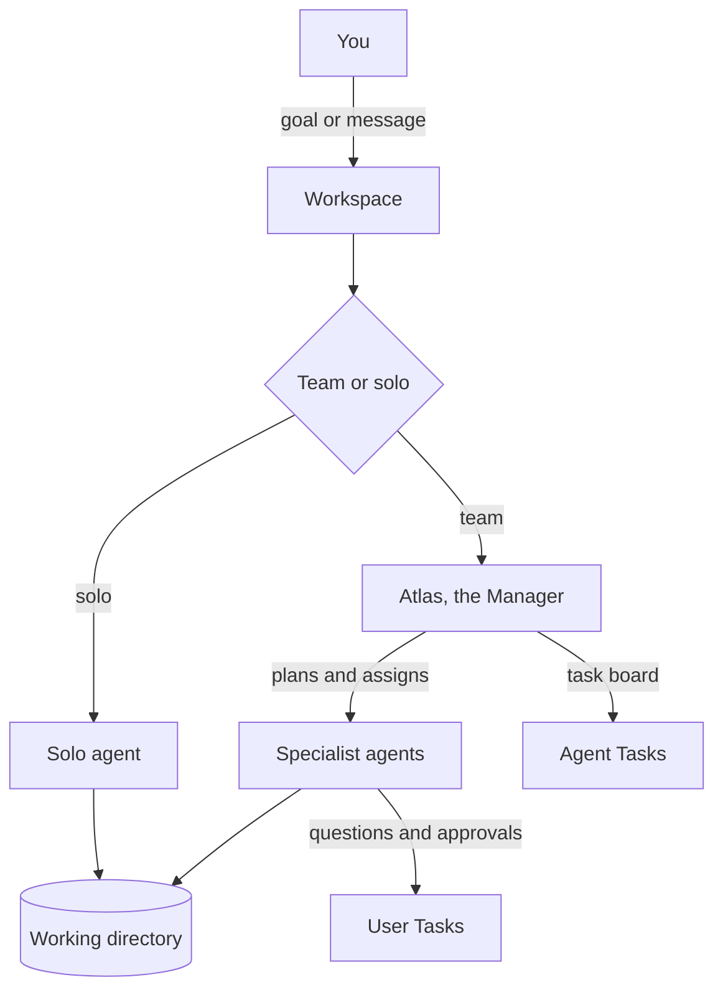

Syndicate is a desktop app for running AI agents against local project folders. You choose the folder, connect your own model providers, and decide whether to work with a coordinated team or one solo specialist.

## The model

## Workspaces

A **workspace** is either a team or a solo agent plus the local folder it works in.

| | Team | Solo agent |
|---|---|---|
| Best for | Multi-role projects | Focused one-role work |
| Agents | Atlas plus specialists | One specialist |
| Coordination | Tasks, delegation, Dispatch | Direct chat |
| Sidebar section | **Team Hub** | **Solo Agents** |

Every workspace has a **working directory**. Agents read, write, and run commands inside that folder. You can relink a team's folder later from Team Settings. If a file lives outside the folder, attach it in chat instead.

<Warning>
Agents with edit permissions change real files. Use a Git repository or another backup before giving agents broad edit access.
</Warning>

## Teams

A **team** is Atlas plus specialist agents sharing one working directory, one task board, and one coordination feed. Teams are best when the work splits into roles, such as build plus review plus test.

Atlas plans phases, creates and assigns tasks, keeps the board clean, and escalates decisions to you. Atlas coordinates rather than implements: specialist agents do the actual work.

See [Teams](/features/teams).

## Agents

An **agent** is a single AI worker with a name, specialization, model, Soul, skills, tools, context settings, and permission mode.

Specializations come from the Marketplace. Skills are slash-command workflows bundled with those specializations. MCP servers are external tools you install globally and enable per agent.

See [Agents](/features/agents).

## Dispatch

**Dispatch** is how agents run. An agent wakes when:

- you message it directly
- Atlas assigns it a task
- a teammate sends work its way

During a run, the agent sees its Soul, recent conversation, relevant team context, tasks, references, and tool settings. It works in the working directory and reports back in chat, the task board, and activity logs.

## Where Things Show Up

| Surface | What it holds | Who acts |
|---|---|---|
| **Chat** | Your direct conversation with Atlas or an agent | You |
| **User Tasks** | Questions, approvals, and decisions waiting on you | You |
| **Agent Tasks** | The work board: every task with owner and status | Atlas, with optional user cleanup |
| **Task Health** | Stale, unclear, or unowned work Atlas should clean up | Atlas |
| **Dispatch** | Coordination feed for team activity | Usually nobody; read for visibility |
| **Activity** | Commands, file changes, and run events | You review |
| **Files / Uploads** | Agent-created files and files you attached | You review or reuse |

## Workspace Lifecycle

- **Create** from the sidebar `+` buttons or command palette.
- **Pause** a team with Team Hard Pause to block auto-dispatch until resumed.
- **Stop** a running agent or team from the header controls.
- **Relink** the working directory from Team Settings.
- **Delete** a team from Team Settings. Project files are not deleted.

## Next Steps

<CardGroup cols={2}>
  <Card title="Create your first team" icon="users" href="/guides/create-your-first-team/quick-start">
    The fastest path to a running team.
  </Card>
  <Card title="Teams" icon="users" href="/features/teams">
    Dashboard, tasks, Atlas, and team controls.
  </Card>
  <Card title="Agents" icon="robot" href="/features/agents">
    Configuration, skills, tools, and permissions.
  </Card>
  <Card title="Providers and models" icon="microchip" href="/features/providers-and-models">
    Supported providers, models, and auth behavior.
  </Card>
</CardGroup>
