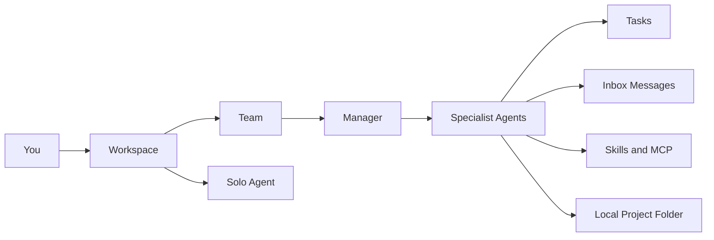

Syndicate turns a local project folder into a workspace where AI agents can plan, build, review, research, document, and coordinate with each other.

## Main feature areas

<CardGroup cols={2}>
  <Card title="Teams" icon="users" href="/features/teams">
    Run a group of specialist agents under a Manager.
  </Card>
  <Card title="Solo agents" icon="user" href="/features/solo-agents">
    Work directly with one specialist agent.
  </Card>
  <Card title="Agent marketplace" icon="sparkles" href="/features/agents">
    Create agents from built-in or custom specializations.
  </Card>
  <Card title="Providers and models" icon="plug" href="/features/providers-and-models">
    Connect Claude, Codex, and Gemini, then choose models per agent.
  </Card>
  <Card title="MCP" icon="blocks" href="/features/mcp">
    Connect agents to external tools and data sources.
  </Card>
  <Card title="Tasks and dispatch" icon="list-checks" href="/features/chat-and-dispatch">
    Send work to agents and track what is happening.
  </Card>
</CardGroup>

## How the pieces fit together

## Common ways to use Syndicate

| Goal | Use |
| --- | --- |
| Fix a bug | Solo engineer or team with Manager, Coder, and QA |
| Build a feature | Team with Manager plus specialists |
| Review code | Code review team or QA specialist |
| Write docs | Technical writer agent with project references |
| Research a topic | Researcher or research team |
| Coordinate many tasks | Team workspace with Manager control modes |

## Recommended first setup

Start with one provider, one local project folder, and either:

- A solo agent for direct work.
- A small team with a Manager, Coder, and Reviewer.

Add more agents, skills, and MCP servers only when the workflow needs them.
